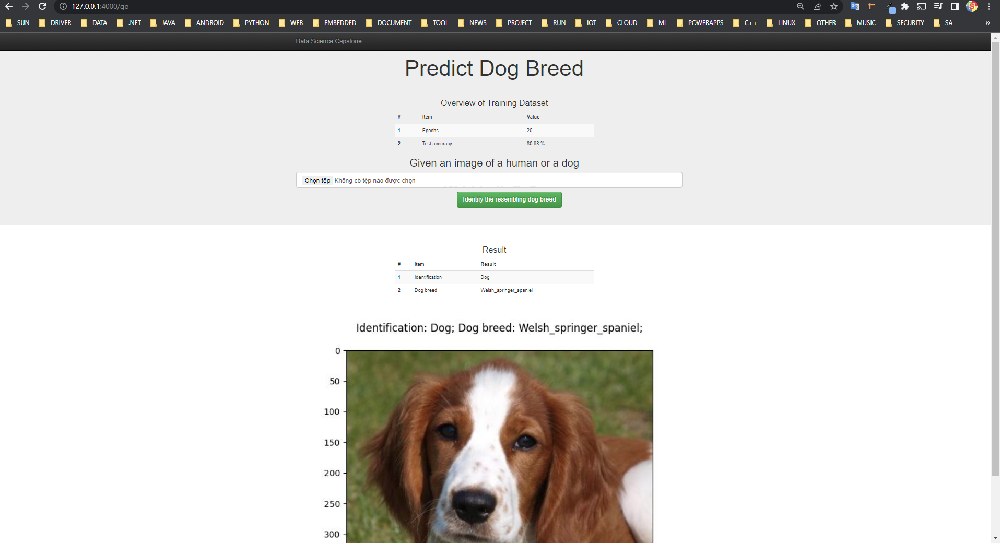

<h1 align="center">Data Scientist Capstone Project</h1>
<h2 align="center">Dog Breed Classifier</h2>

 With this project, we know how to uses Convolutional Neural Networks (CNNs)!, how to build a pipeline to process real-world, user-supplied images, algorithm identify an estimate of the canine’s breed. If supplied an image of a human, it will identify the resembling dog breed.

## Instructions:
1. Run the following commands in the Data folder of this project to install libraries. ( pip install -r requirements/requirements-gpu.txt )

2. Run the following commands in the project's root directory or open start.bat to build, train model and build a web of this project
( start.bat )

3. Web link : 127.0.0.1:4000

4. Upload an image of a human or a dog then click to Identify the resembling dog breed button. try with images in folder data/Test

## File Descriptions
1. Data
    - data folder : 
    + bottleneck_features;
    + dog_images: Download the [dog dataset](https://s3-us-west-1.amazonaws.com/udacity-aind/dog-project/dogImages.zip).  Unzip the folder and place it in the repo, at location `Data/dogImages`.
    + haarcascades;
    + lfw: Download the [human dataset](https://s3-us-west-1.amazonaws.com/udacity-aind/dog-project/lfw.zip).  Unzip the folder and place it in the repo, at location `Data/lfw`.
    + requirements;
    + Test;

2. Models
    - To build model: train_classifier.py
    - Models file

3. App
    - templates folder : web tempplate (master.html);
    - static/images folder: store temp image
    - to run the web : run.py

## Licensing, Authors
- This project is public that can be used by any one have the <a href="https://github.com/SandHome/Data_Scientist_Capstone">LINK</a> of this project
- Authors : Vũ. Phạm Thế (MR)
